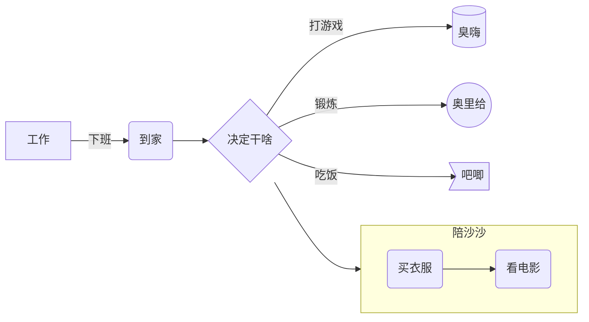
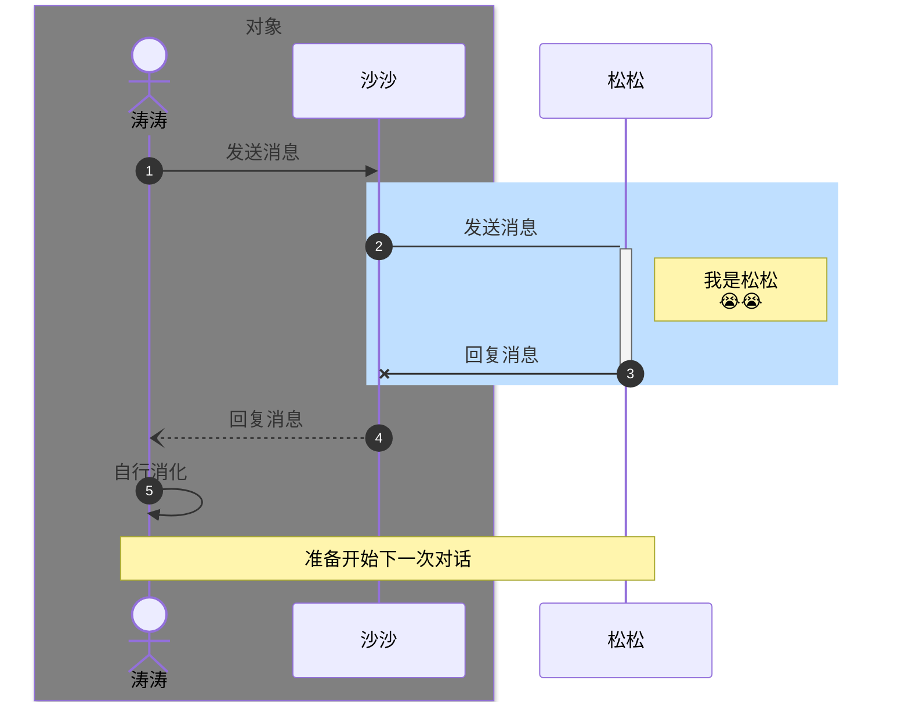
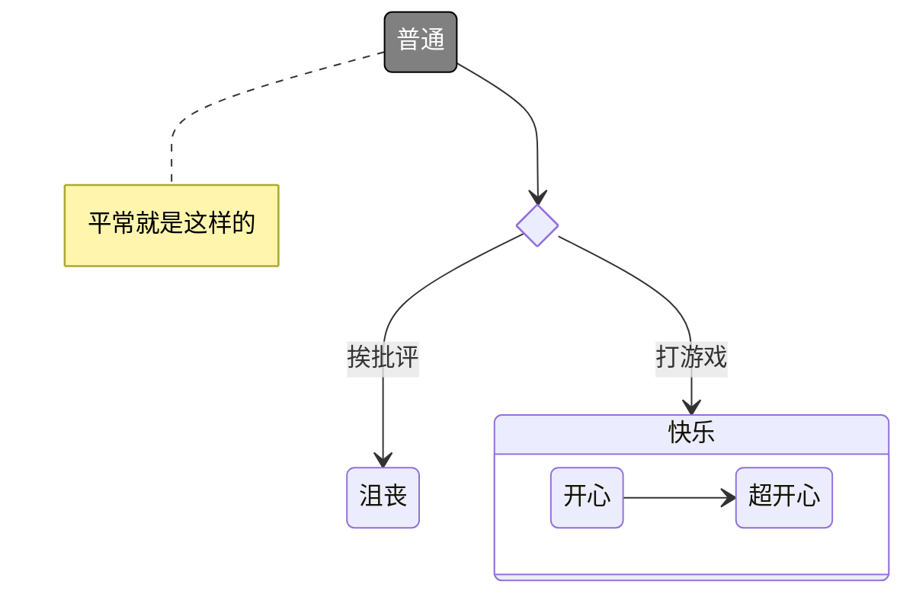

## 背景

市面上 processon、drawio 等需要过多关注页面样式，在时序图这种强业务场景，后端更需要专注在流程上。

## [Mermaid](https://mermaid.js.org/)

Mermaid 是一种轻量级的开源图表描述语言，用于在 Markdown 文档中创建流程图、时序图、甘特图、类图等各种类型的图表。

> 在线编辑：https://mermaid.live/

## 流程图

```mermaid
flowchart LR
    A[工作]
    B(到家)
    C{决定干啥}
    D[(臭嗨)]
    E((奥里给))
    F>吧唧]

    G(买衣服)
    H(看电影)

    A -->|下班| B
    B --> C
    C -->|打游戏| D
    C -->|锻炼| E
    C -->|吃饭| F
    C --> 陪沙沙

    subgraph 陪沙沙
        direction LR
        G --> H
    end
```

## 时序图

```mermaid
sequenceDiagram
    %% 开启自动行码
    autonumber
    box grey 对象
        actor 涛涛
        participant 沙沙
    end
    participant 松松
    涛涛->>沙沙: 发送消息
    %% +/- 代表激活
    rect rgb(191, 223, 255)
        沙沙->+松松: 发送消息
        note right of 松松: 我是松松<br>😭😭
        松松-x-沙沙: 回复消息
    end
    沙沙--)涛涛: 回复消息
    涛涛->>涛涛: 自行消化

    note over 涛涛,松松 :准备开始下一次对话
```

消息箭头有几种形式；
- -实线，--虚线
- \>没有箭头，>>有箭头
- x 指 x 结尾，) 空心箭头用作异步 

## 状态图

```mermaid
stateDiagram
    state 动作校验 <<choice>>

    classDef gray fill:gray,color:white,stroke:black

    普通:::gray --> 动作校验
    note right of 普通 :平常就是这样的
    动作校验 --> 快乐 :打游戏
    state 快乐 {
        direction LR
        开心 --> 超开心
    } 
    动作校验 --> 沮丧 :挨批评
```

