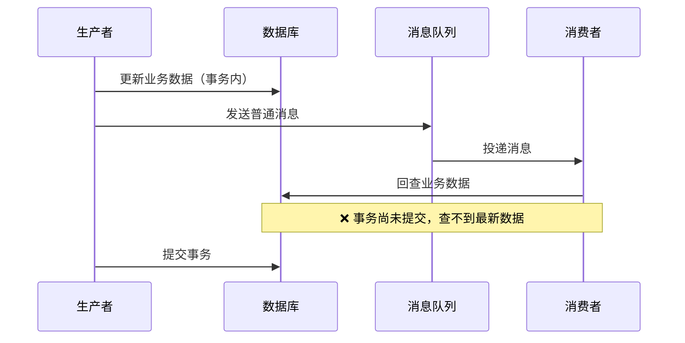
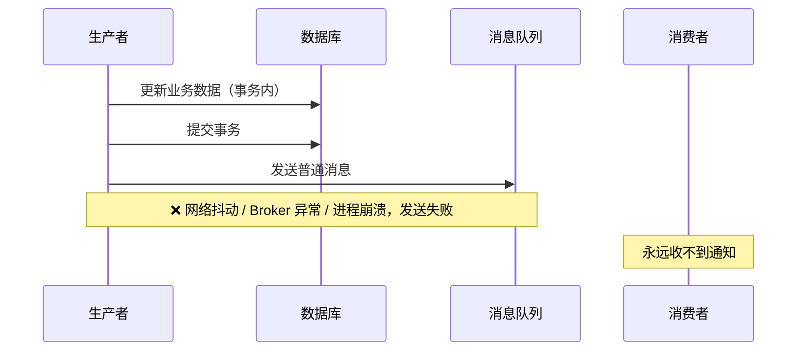
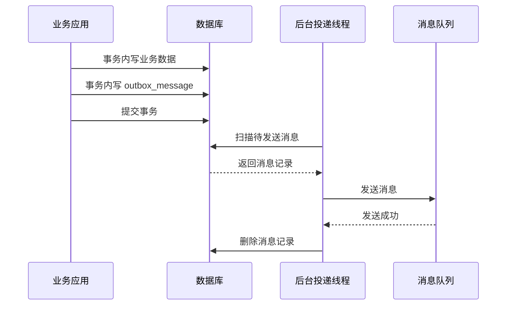

## 1 问题背景

业务中经常有这样的场景：本地数据库改完，还要发一条 MQ 通知下游。比如订单支付成功后，通知履约系统开始发货。

典型代码：

1. 更新订单状态为"已支付"；
2. 发送"订单已支付"消息；
3. 提交本地事务。

这段代码把**数据库提交**和 **MQ 发送**当成了两个独立动作，它们的时序没有任何保证，会引出两类问题：

**第一类：消息先到，数据未到。** 消费者收到消息回查订单时，生产者的事务可能还没提交，查不到最新数据。



根源：**消息对外可见的时机，早于本地事务提交的时机**。

**第二类：一边成功，一边失败。** DB 提交成功了，MQ 发送却因为网络抖动或 Broker 故障而失败——下游永远收不到通知。



反过来，先发 MQ 再提交事务，消息被消费了但事务最终回滚，下游收到了一条不该存在的事件。

这两类问题本质相同：**本地事务和消息发送不是原子动作**。所以事务消息真正要解决的是——

- 消息应该在什么时机对外可见；
- 本地事务和消息投递如何保持一致。

## 2 什么是 Outbox

Outbox，直译就是"发件箱"。写邮件的时候，点发送后邮件不会立刻飞到收件人那里，而是先进发件箱，再由邮件客户端异步投递出去。

把发件箱的思路搬到数据库里，就是 Outbox 模式：**不把"数据库提交"和"MQ 发送"硬塞进一个分布式事务，而是先把消息写进本地数据库，再由后台线程异步投递到 MQ**。

一句话概括：事务里负责"记下来"，事务外负责"发出去"。

这直接化解了第一章的两类问题：

- **时序问题**：消息记录和业务数据在同一个事务里提交，不存在"先发后提交"——事务提交前，消息记录对其他线程不可见；
- **一致性问题**：即使 MQ 发送暂时失败，消息仍然留在本地表里，后续可以补发，不会丢失。

## 3 Outbox 的核心设计

Outbox 的最小实现只涉及两块：一张消息表，外加向这张表写消息和从这张表读消息的两段代码。

### 3.1 消息表

```sql
CREATE TABLE outbox_message (
  id BIGINT PRIMARY KEY AUTO_INCREMENT,   -- 消息唯一标识
  topic VARCHAR(128) NOT NULL,            -- 要发送到的主题
  tag VARCHAR(64) DEFAULT NULL,           -- 可选标签（如 '*'、'paid'）
  payload TEXT NOT NULL,                  -- 消息体
  created_at DATETIME NOT NULL            -- 创建时间，便于扫表排序与补偿追踪
);
```

这是一张为了讲原理而抽象的最小表，真实工程中可按需扩展。

### 3.2 事务内落表

业务事务内只写数据库，不直接发 MQ：

```java
@Transactional
public void completeOrder(Order order) {
    orderRepository.updateStatus(order.getId(), "PAID");

    OutboxMessage message = new OutboxMessage(
        "order-paid-topic",
        "paid",
        toJson(new OrderPaidEvent(order.getId()))
    );
    outboxRepository.insert(message);
}
```

写业务表和写 `outbox_message` 在同一个本地事务里，一起提交或一起回滚。消息记录就是业务事务的一部分。

### 3.3 异步投递、清理与补偿

事务提交后，后台线程扫描 `outbox_message` 表，把待发送消息投递到 MQ：

```java
public void dispatchOutboxMessages() {
    List<OutboxMessage> messages = outboxRepository.selectPendingMessages(100);
    for (OutboxMessage message : messages) {
        mqProducer.send(message.getTopic(), message.getTag(), message.getPayload());
        outboxRepository.deleteById(message.getId());  // 发成功就删
    }
}
```

- **发送成功则删除**——留在表里的就是还没发出的，语义直接；
- **发送失败则留给下一轮**——MQ 发送可能因为网络抖动、Broker 故障或进程崩溃而失败，但只要记录还在表里，后续扫表或重试就能继续投递。

因此，正式实现通常有两层保障：短周期快速重试兜住瞬时故障，定时扫表补偿兜住长尾残留。原则很简单——

> 只要消息还留在表里，它就仍然有机会被继续发送。

## 4 消息发送链路

一条消息从产生到送达，经过三个阶段，用一张图就能看清：



1. **事务内阶段**——业务数据和消息记录在同一个事务里提交，要么一起成功，要么一起失败；
2. **事务提交后**——后台线程扫描消息表，投递到 MQ，发送成功则删除；
3. **补偿阶段**——如果发送失败或进程在删除前崩溃，消息仍在表中，下一轮扫表继续投递。

核心就一句话：**数据库提交决定消息有没有资格发，后台补偿决定消息最终能不能到。**

## 5 几个关键问题

### 5.1 为什么提交前不会误发

在本地事务提交之前，消息记录对其他连接不可见。后台线程就算提前扫表，也看不到这条新插入的记录。只有事务真正提交后，消息才会进入可扫描范围。Outbox 依赖的不是"神奇的发送时机控制"，而是数据库事务本身的可见性规则。

### 5.2 为什么会重复发送

Outbox 能保证"事务成功后消息最终可发"，但不能天然保证"只发一次"。最典型的重复场景：

1. 后台线程把消息成功发到了 MQ；
2. 但在删除消息表记录之前，进程挂了；
3. 下一轮补偿扫描又看到了这条残留记录；
4. 同一条消息被再次发送。

所以 Outbox 天然是**至少一次投递**语义，不是 exactly-once。

### 5.3 为什么消费端必须幂等

既然生产端存在重复投递的可能，消费端幂等就不是"优化项"，而是"必需项"——消费者必须能正确处理同一业务消息被多次投递的情况。

换句话说，Outbox 的工程闭环是：**生产端通过消息表 + 补偿保证最终送达，消费端通过幂等消化重复投递。**

## 6 和 RocketMQ 事务消息的区别

两者都在解决"本地事务与消息投递一致性"，但设计重心不同。

| 维度 | Outbox | RocketMQ 事务消息 |
|------|--------|------------------|
| 一致性锚点 | 数据库——先确保事务提交、消息落表 | Broker——通过半消息和事务回查参与协调 |
| 第一落点 | 本地消息表 | Broker 中的 half message |
| 补偿机制 | 扫表重试——记录在表里就有机会 | Broker 对事务状态回查与确认 |
| 适用场景 | 强依赖本地事务、以 DB 为真相源 | 愿意把协调责任交给 Broker、围绕 MQ 事务模型编码 |

两者不是谁更先进，而是设计重心不同。

## 7 实现中的取舍与优化建议

本文为突出原理，用了最简模型。落地时通常还需要做几个增强。

### 7.1 删除式还是状态式

本文的发成功就删是删除式模型，语义简单，足够构成最小闭环。如果系统对审计、追踪或失败留痕要求更高，可以改为状态式——把"待发送、已发送、发送失败"显式留存。

### 7.2 扫表频率与发送延迟

扫表频率直接影响消息时延：太频繁增加 DB 压力，太慢拉长延迟。实践中扫表周期通常在 1-5 秒，配合下文的进程内快速重试，正常路径延迟可控制在百毫秒级。

### 7.3 进程内快速重试

定时扫表能保证最终一致性，但瞬时故障会被放大成明显延迟。通常增加一层进程内快速重试：短周期（100ms-500ms）吸收瞬时失败，扫表任务兜底长尾残留。

### 7.4 消息表膨胀

长期运行后，消息表本身可能成为负担。需要考虑定期归档、历史数据清理、大表治理，必要时分库分表或冷热分离。

## 8 总结

Outbox 不试图让"数据库提交"和"MQ 发送"变成一个严格同步的原子动作，而是换了一种更务实的思路：

1. 先在本地事务里把消息可靠地记下来；
2. 再通过异步发送和补偿机制，把消息最终送到 MQ。

它解决的核心问题是让**消息对外可见的时机晚于本地事务提交的时机**，避免普通消息模式的时序错乱和一致性缺口。

代价很明确：发送不再是严格实时，系统需要接受补偿机制和至少一次投递语义，消费端必须幂等。

但在以数据库为中心的业务系统里，这些代价通常是值得的——Outbox 与本地事务天然兼容，可补偿、可排障、可追踪，落地成本可控。
