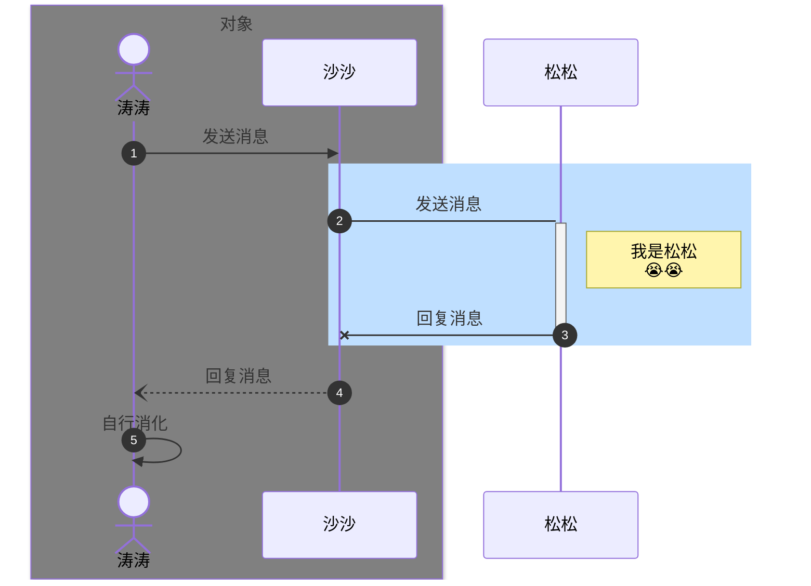

## 背景

市面上 processon、drawio 等需要过多关注页面样式，在时序图这种强业务场景，后端更需要专注在流程上。

## [Mermaid](https://mermaid.js.org/)

Mermaid 是一种轻量级的开源图表描述语言，用于在 Markdown 文档中创建流程图、时序图、甘特图、类图等各种类型的图表。

> 在线编辑：https://mermaid.live/

## 流程图

## 时序图

消息箭头有几种形式；
- -实线，--虚线
- \>没有箭头，>>有箭头
- x 指 x 结尾，) 空心箭头用作异步 

## 状态图

